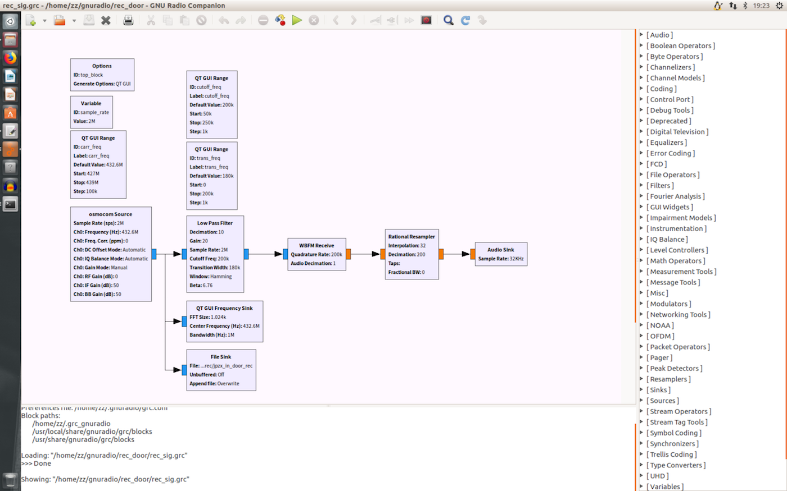
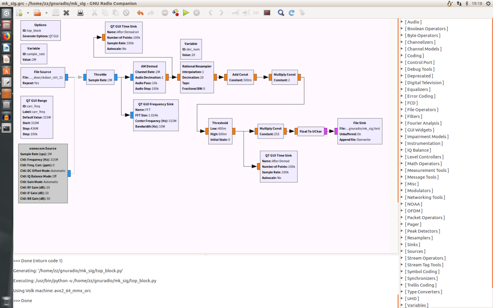
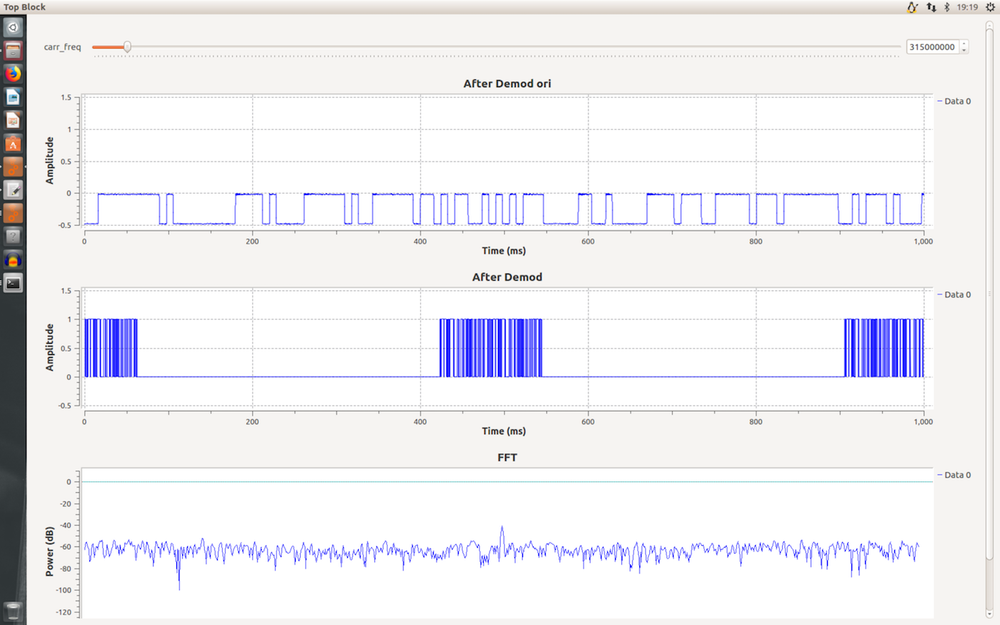
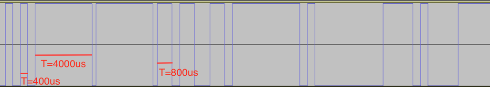
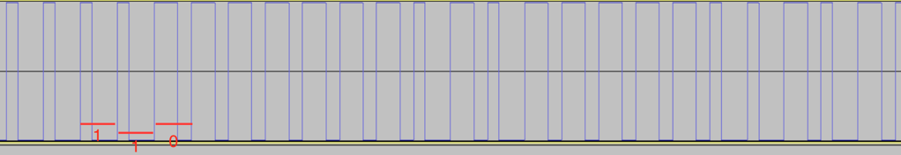
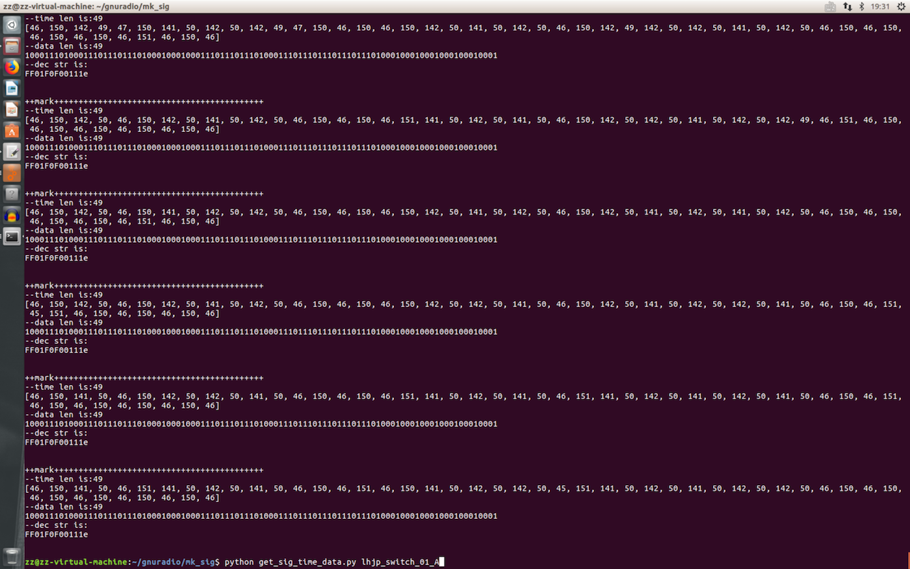
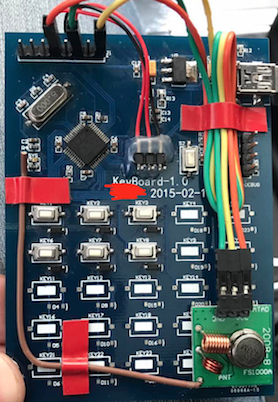

## 无线遥控器ASK固定编码的数据监听和重放

### 0x01 软硬件使用清单

- hackrf one 或者 rtlsdr 等sdr工具
- gnuradio-companion
- python
- stm32单片机
- 433MHZ或者其他频率的超外差发射模块

###  0x02 确定监听频率

- 拆解遥控器查看RF部分的晶振频率
- 或者使用gqrx监听空中信号，寻找遥控器按键按下时出现波峰的频率值

### 0x03 录制信号

- 文件 ` rec_sig.grc ` 为 gnuradio-companion 使用的信号录制模块，用来录制原始信号的数据并存入硬盘，原始数据比较大，录制后可以通过audacity打开来简单分析，或者在下一步解调分析。
- 

### 0x04 解调信号

- 文件 `mk_sig.grc` 用来使用上一步录制的信号进行ASK信号的解调。
- 如果不需要录制信号的话，可以不进行上一步操作，在这里直接disable掉file source模块并enable osmocom source，直接对SDR采集的数据进行解调，并生成解调后的数据文件。
- 这个流程图中使用AM Demod对信号解调，使用Add Count和Multiply Count和Threshold对解调后的信号归一化处理，解调后的数据文件为二进制数据，只包含0x00和0xFF两种字节。其中0x00字节代表原始信号的0，0xFF代表原始信号的1。0x00和0xFF出现的次数代表原始信号持续的时间，这个时间可以通过出现次数*采样周期来计算出来。
- 
- 

### 0x05 解码信号

- 解调出来的文件使用xxd打开，形如 `0027ecd0: 0000 0000 0000 0000 0000 00ff ffff ffff  ................`序列，其中00代表0，ff代表1，该序列代表0000000000011111的序列。可以根据文件中0或者1出现的次数，结合采样率和波形图来分析原始数据，0或者1出现的次数*采样周期等于该信号持续出现的时间。

- 目前接触到两种编码方式，第一种调制方式属于时长编码，非归零编码方法。每个高电平时间单位为400us，代表一个1。则800us高电平代表11，1200us高电平代表111，同样的低电平时长代表对应的0，以此类推。第二种调制方式属于曼彻斯特编码，归零编码方法，每个时间片单位为200us，200us高400us低代表1，400us高200us低代表0，如图可分析出调制的数据序列。

- 第一种编码方式，在小区车道门禁中常见：

- 第二种编码方式，固定码遥控芯片PT2262或EV1527：

  

- 文件 `get_sig_time_data.py` 为第二种编码方式的解码程序，解码数据如下：

- 

- 解码数据为`FF01F0F00111` ，为固定地址码FF01F0F0和遥控器键值 0111，具体可参见PT2262的datasheet，此处不复赘述。

### 0x06 信号重放

- 为了设备的便携性，重放装置的RF部分使用超再生模块，某宝4块一对收发都有了，注意选对频率。控制部分使用Arduino或者其他单片机。测试过树莓派，由于ubuntu系统操作GPIO在us级别延迟抖动比较大，因此没有采用树莓派。

- 控制GPIO为高低电平即可发送信号。

- 本测试仅为安全研究，重放代码不再放出。

- 已知存在安全隐患的设备：
  - 使用PT2262或者EV1527芯片的设备，例如：某厂家门禁控制器、某厂家电动自行车遥控器

  - 未使用以上芯片但使用了自定义固定编码方案的遥控器：小区车道门禁蓝牙识别系统